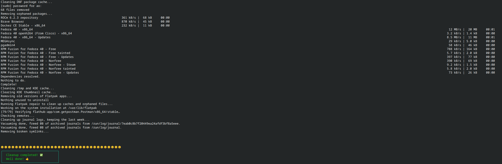

# fedora_cleanup
A script to clean Fedora OS with KDE 

# How to run it

#### Step 1: Download the file into your computer 
For example, save it to your ~/Downloads directory.

#### Step 2: Make the file executable: 
Navigate to the directory where the script is saved. 
Assuming the file is downloaded into the `Downloads` folder, use this commands:
```bash
`cd ~/Downloads && chmod +x fedora-cleanup.sh`
```

If the file is downloaded into a different directory, change the "`~/Downloads`" part accordingly 

#### Step 3: Run the script:
To run the script, use the following command:
```bash 
./fedora-cleanup.sh
```

You will be prompted to enter your `root` password. Wait for the script to finish executing.

## Optional Commands

There are some commands in the script that are marked as OPTIONAL. These commands should only be run occasionally 
(e.g., monthly or more). If you need them, uncomment the relevant lines in the script, save the file, and then run the script 
as described above.

** The script assumes that you have Flatpak repositories enabled as well. If you do not, please comment out or remove the 
Flatpak scripts, as they are unnecessary and may cause the Terminal to throw an error.

### Sample Output
